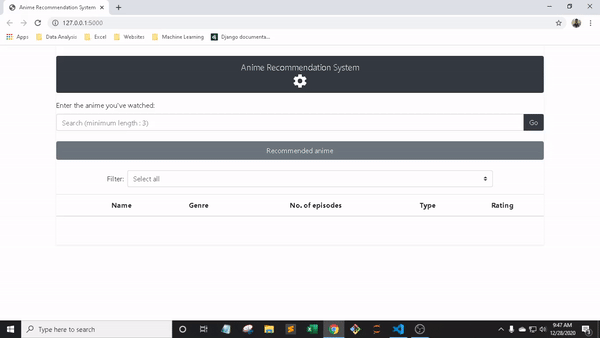

## Anime Recommendation System

### Recommendation using Pearson Correlation
https://github.com/markbirds/Anime-Recommendation-System/blob/master/model/anime_recommendation_pearson_r.ipynb

### Recommendation using Nearest Neighbors
https://github.com/markbirds/Anime-Recommendation-System/blob/master/model/anime_recommendation_nearest_neighbors.ipynb

### Dataset
```
https://www.kaggle.com/CooperUnion/anime-recommendations-database
```

### Sample



### License

This project is licensed under the terms of the [MIT License](LICENSE).
