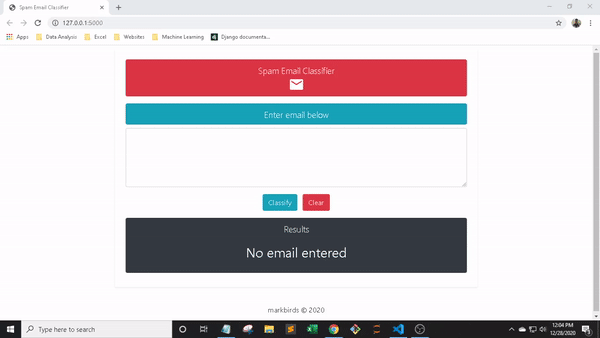

## Spam Email Classification

### Jupyter notebook used in Data analysis and Model building
https://github.com/markbirds/Spam-Email-Classifier/blob/master/model/spam-email-classifier.ipynb

### Try it on
https://mb-spam-email-classifier.herokuapp.com/

### Model score
```
Naive Bayes: 0.97
```

### Dataset
```
https://www.kaggle.com/nitishabharathi/email-spam-dataset
```

### Sample




### License

This project is licensed under the terms of the [MIT License](LICENSE).

